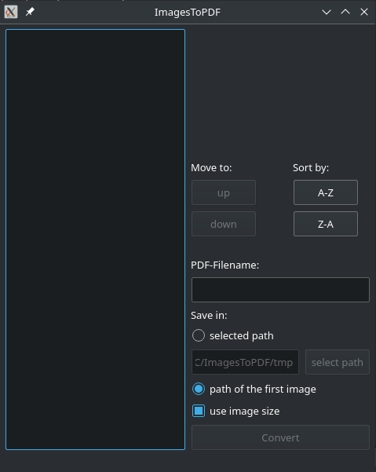

readme Sprachen: [English](README.md),[German](README.de_DE.md)
# ImagesToPDF
ImagesToPDF ist eine Software mit graphischer Nutzeroberfläche zum Konvertieren von Bildern in eine PDF. Es benötigt das PoDoFo Tool podofoimg2pdf um Bilder in eine PDF umzuwandeln.

## Screenshots
- Manjaro (KDE)

    

## Getested
- Manjaro (KDE)

## Vorraussetzung
PoDoFo Tool podofoimg2pdf muss installiert sein (http://podofo.sourceforge.net/).  

## Benutzung
1. Bilder hinzufügen per drag & drop oder mithilfe eines Rechts-Klicks auf die linke Liste  
2. Dateiname hinzufügen  
3. Pfad auswählen  
4. Auf den Knopf Konvertieren drücken  

## Beitragen
"Forken" Sie das Projekt, machen Sie Ihre Änderungen und senden Sie mir ein "pull request". Für größere Änderungen öffnen Sie bitte zuerst ein "issue", um vorher abzuklären, was Sie ändern möchten.

## Lizenz
Das Projekt ist unter der Lizenz GPLv3 veröffentlicht worden
