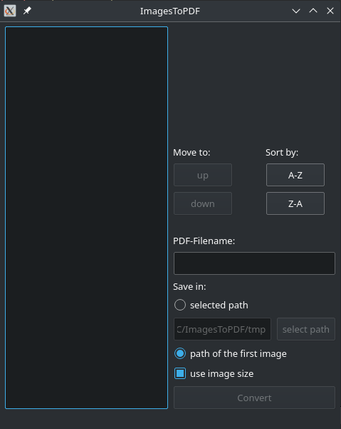

readme languages: [English](README.md),[German](README.de_DE.md)
# ImagesToPDF
ImagesToPDF is a software with graphical user interface to convert images to PDF. It use the PoDoFo Tool podofoimg2pdf to convert images to PDF.

## Screenshots
- Manjaro (KDE)

    

## Tested
- Manjaro (KDE)

## Requirments
The PoDoFo Tool podofoimg2pdf must installed (http://podofo.sourceforge.net/).  

## Using
1. Add images via drag & drop or right click to the left list  
2. Add filename  
3. Select path  
4. Press convert  

## Contributing
Fork this project, make your changes and send me a pull request. For major changes, please open issue first to discuss what you would like to change.

## License
Project is released under GPLv3 License
